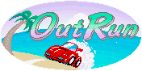
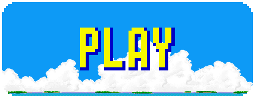

# OutRun

    

This project is an imitation of Sega's arcade racing game <a href="https://en.wikipedia.org/wiki/Out_Run">Out Run</a>. While some parts of the project are directly imitated from the original game, some parts are different.

    

## To-Do List
* Transmission algorithm
* Collision
* In-game live map
* Difficulty
* "How to" screen

## What I Learned
* Canvas in HTML
* JavaScript
* Basic game engine development
* Arcade machine ROMs
* Sprite manipulation

## Credits
Original sprites, sound effects and music are used in this project under the purpose of fair use.
